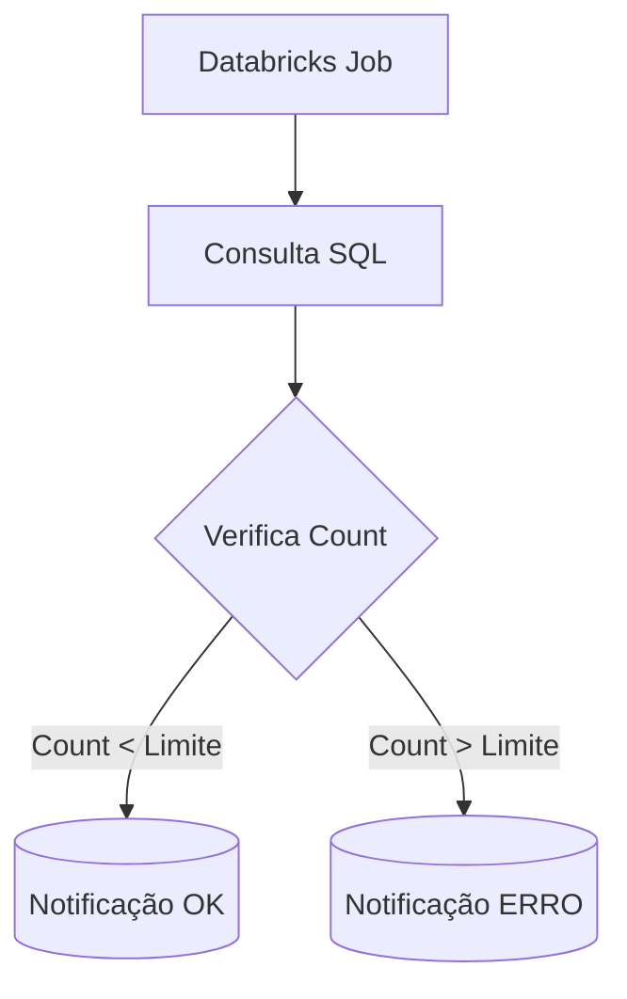

# 🚀 Databricks Alerts to Teams [](https://databricks.com/)

[](https://www.python.org/)
[](https://spark.apache.org/)
[](https://learn.microsoft.com/en-us/microsoftteams/platform/webhooks-and-connectors/how-to/add-incoming-webhook)

## 📌 Visão Geral
Sistema de monitoramento que:

✔ **Valida automaticamente** volumes de dados no Databricks  
✔ **Envia alertas** para canais do Microsoft Teams  
✔ **Previne inconsistências** em processos ETL  



## ⚙️ Funcionamento do Código
### Fluxo Principal
```python
# 1. Consulta no Databricks 
df = sqlContext.sql("""
  SELECT codigo_x AS QTD_CLI,
         date_format(atualizacao,'yyyyMM') AS DATA_REFERENCIA
  FROM tabela
  WHERE xpto1 = 'F' 
  AND atualizacao = '2024-06-28'
""")

# 2. Validação 
if df.count() > 0:
    status = "OK" if df.count() < 488000 else "ERRO"
    
    # 3. Notificação 
    mensagem = pymsteams.connectorcard("<WEBHOOK_URL>")
    mensagem.text(f"STATUS: {status} - Registros: {df.count()}")
    mensagem.send()
```

## 📊 Contexto Bancário (LGPD)
```python
# Campos sensíveis omitidos
WHERE xpto4 IN ('N')  # Filtro regulatório
AND xpto3 IN ('004', '005', '006')  # Códigos internos
```

## 🛠️ Tecnologias Utilizadas
| Tecnologia         | Uso no Projeto                     | Detalhe |
|--------------------|------------------------------------|---------|
| PySpark           | Processamento distribuído          | `sqlContext.sql()` |
| pymsteams         | Integração com Teams               | `connectorcard()` |
| Pandas            | Análise adicional (se necessário)  | Opcional |

## 🚀 Como Implementar
1. **Configure o Webhook**:
   ```python
   # Substitua pela sua URL real
   pymsteams.connectorcard("https://outlook.office.com/webhook/...")
   ```

2. **Ajuste os Filtros**:
   ```sql
   WHERE xpto1 = 'F' 
   AND atualizacao = '2024-06-28'  
   ```

3. **Execute no Databricks**:
   ```python
   %run /Seu/Path/alertas-databricks-to-teams.ipynb
   ```
---

[](https://www.linkedin.com/in/felipebsdelima)  

[🐛 Reportar issue](https://github.com/felipesbonatti/databricks-alerts-to-teams/issues)


