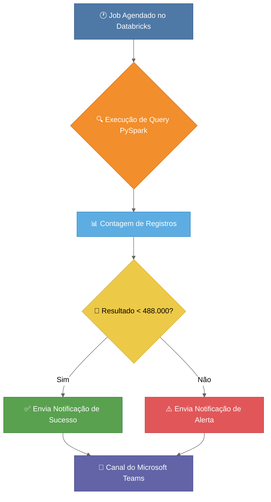

# 🚨 Databricks to Microsoft Teams Alerting System

<div align="center">

[](https://www.python.org/)
[](https://spark.apache.org/)
[](https://databricks.com/)
[](https://learn.microsoft.com/en-us/microsoftteams/platform/webhooks-and-connectors/how-to/add-incoming-webhook)

</div>

---

## 🎯 Visão Geral

Este projeto apresenta um **sistema de monitoramento e alerta** desenvolvido para operar no ambiente Databricks. A solução executa validações de volume de dados por meio de queries PySpark e envia notificações automáticas para um canal do Microsoft Teams.

O principal objetivo é **garantir a integridade e a consistência dos dados** em pipelines de ETL, prevenindo anomalias e falhas de processamento ao verificar se a contagem de registros está dentro de um limite esperado.

## Principais Funcionalidades

<table>
<tr>
<td align="center">
<h3>🔍 Validação Automatizada</h3>
<strong>Consultas SQL Distribuídas</strong><br>
Executa queries PySpark para<br>
monitorar volume de dados
</td>
<td align="center">
<h3>⚡ Alerta por Threshold</h3>
<strong>Detecção de Anomalias</strong><br>
Compara contagem com limites<br>
predefinidos em tempo real
</td>
<td align="center">
<h3>📢 Integração Teams</h3>
<strong>Notificações Instantâneas</strong><br>
Webhooks nativos para alertas<br>
diretos no canal da equipe
</td>
<td align="center">
<h3>🛡️ Prevenção ETL</h3>
<strong>Verificação Proativa</strong><br>
Mecanismo de segurança para<br>
processos de ingestão de dados
</td>
</tr>
</table>

---

## 🔄 Arquitetura e Fluxo de Execução

O processo é executado em um notebook Databricks e segue um fluxo lógico simples e eficaz.


```mermaid
%%{init: {'theme': 'neutral', 'fontFamily': 'Arial'}}%%
graph TD
    A[🕐 Job Agendado no Databricks] --> B{🔍 Execução de Query PySpark}
    B --> C[📊 Contagem de Registros]
    C --> D{🎯 Resultado < 488.000?}
    D -->|Sim| E[✅ Envia Notificação de Sucesso]
    D -->|Não| F[⚠️ Envia Notificação de Alerta]
    E --> G[📱 Canal do Microsoft Teams]
    F --> G

    style A fill:#4e79a7,stroke:#2e557d,color:#fff
    style B fill:#f28e2b,stroke:#d5761d,color:#fff
    style C fill:#5DADE2,stroke:#2E86C1,color:#fff
    style D fill:#edc948,stroke:#d4b02d,color:#000
    style E fill:#59a14f,stroke:#398237,color:#fff
    style F fill:#e15759,stroke:#c13d3f,color:#fff
    style G fill:#6264A7,stroke:#4B4D8C,color:#fff
```

---

## 🛠️ Stack Tecnológica

| **Tecnologia** | **Finalidade no Projeto** | **Implementação** |
|:---------------:|---------------------------|:-----------------:|
| **PySpark** | Processamento distribuído e execução de consultas SQL no cluster | `sqlContext.sql()` |
| **pymsteams** | Integração com API de webhooks do Microsoft Teams | `pymsteams.connectorcard()` |
| **Databricks** | Orquestração e execução automatizada do notebook | `%python` e `%run` |

> **📝 Nota:** A biblioteca `pandas` é importada no notebook, mas não é utilizada no fluxo de código atual.

---

## 🚀 Como Implementar

### **1️⃣ Configurar o Webhook no Microsoft Teams**

Crie um "Incoming Webhook" no canal do Teams onde deseja receber os alertas e substitua a URL no código.

```python
# Substitua "conector webhook" pela URL real do seu webhook
myTeamsMessage = pymsteams.connectorcard("https://outlook.office.com/webhook/...") 
myTeamsMessage.text(texto)
myTeamsMessage.send()
```

### **2️⃣ Ajustar a Query SQL**

Modifique a consulta para refletir sua tabela, filtros e lógicas de negócio. Preste atenção especial aos seguintes campos:

- `--PATH.SUA_TABLE`: O caminho completo da tabela que será monitorada
- `WHERE`: Os filtros de data (`atualizacao`) e outras colunas (`xpto1`, `xpto2`, etc.)

```sql
SELECT codigo_x AS QTD_CLI,
       date_format(atualizacao,'yyyyMM') AS DATA_REFERENCIA
FROM --PATH.SUA_TABLE
WHERE xpto1 = 'F' 
  AND xpto2 BETWEEN '2024-06-01' AND '2024-06-31' 
  AND xpto3 IN ('004', '005', '006', '007', '106','001', '002', '003', '304','009')
  AND xpto4 IN ('N')
  AND atualizacao = '2024-06-28'
```

### **3️⃣ Definir o Limite de Validação**

Ajuste o valor do limite (`488000`) na estrutura condicional `if` para alinhá-lo com a volumetria esperada.

```python
# Ajuste o valor 488000 conforme sua necessidade
if (df.count() < 488000):
  texto = texto + "TEXTO " + str(df.count()) + " TEXTO \\n"
else:
  texto = texto + "TEXTO " + str(df.count()) + " TEXTO_ERRO. Verificar a query. \\n"
```

### **4️⃣ Executar no Databricks**

Salve o notebook em seu workspace e execute-o manualmente ou agende-o como um Job para rodar em intervalos definidos (ex: diariamente).

---


